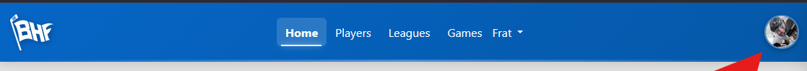
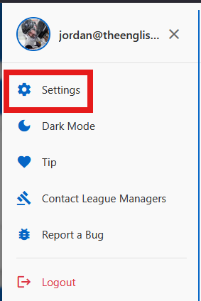
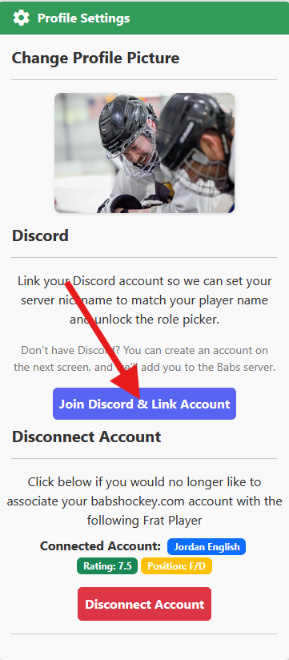
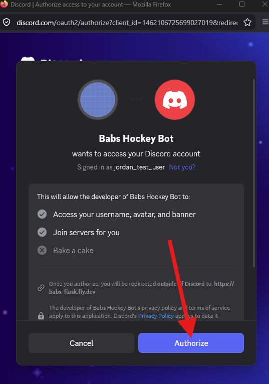

# Link your Discord account to babshockey.com

New members of the Babs Hockey Frat Discord server can only see **#welcome** and **#help** until they link their Discord account to their babshockey.com player. Linking takes about a minute. Once it's done:

- your server nickname is set to match your player name
- the rest of the server opens up, including the role picker in **#get-your-role**, where you choose your league

**You'll need:** a babshockey.com login connected to your Frat player. A Discord account is optional. If you don't have one, you can create it during step 3.

## 1. Open your profile menu

Log in at [babshockey.com](https://babshockey.com) and click your profile picture in the top-right corner.

## 2. Go to Settings

## 3. Click "Join Discord & Link Account"

In **Profile Settings**, find the **Discord** section and click **Join Discord & Link Account**.

> **Don't click "Disconnect Account."** That button is lower on the same page and has nothing to do with Discord. It unlinks your babshockey.com login from your Frat player.

## 4. Authorize Babs Hockey Bot

Discord will ask you to authorize **Babs Hockey Bot**. First check the **Signed in as** line. If it doesn't show the Discord account you use for the Frat, click **Not you?** and switch accounts.

Then click **Authorize**.

This lets us match your Discord account to your player and add you to the Babs server, so you don't need an invite link.

## 5. Confirm it worked

Open the Babs Discord server and check that:

- [ ] your nickname in the server matches your player name
- [ ] you can see channels beyond #welcome and #help, e.g. #general and #announcements
- [ ] you can open **#get-your-role**. Pick your league/day there to unlock that league's channels.

## Troubleshooting

| Problem | Try |
|---|---|
| Still only seeing #welcome and #help | Fully close and reopen Discord (or refresh the browser tab). If nothing changes, run through steps 1–4 again. |
| Linked the wrong Discord account | Repeat step 4, using **Not you?** to switch to the right account. |
| Anything else | Post in **#help** on the Discord server, or use **Contact League Managers** in the babshockey.com profile menu. |
